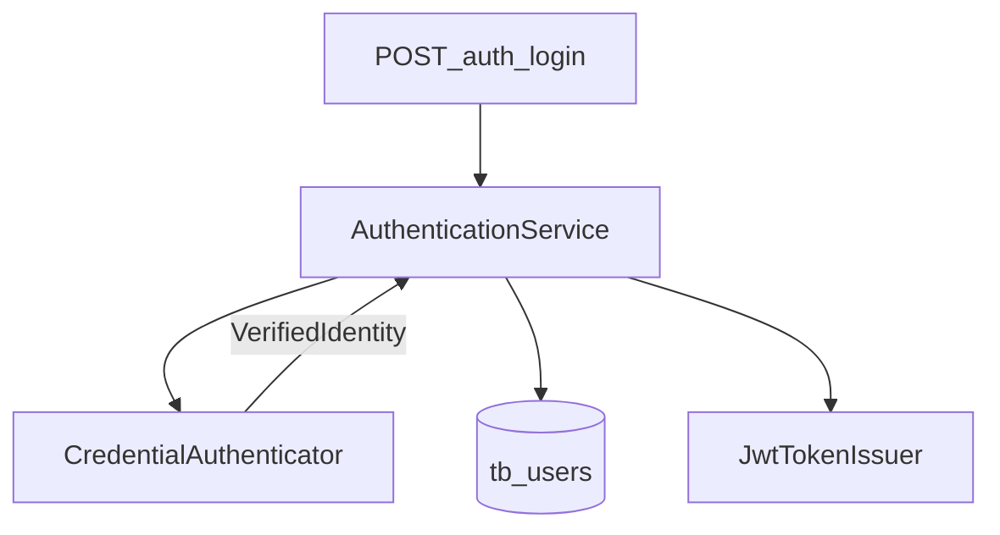

# Authentication

**Feature version:** 3  
**Status:** done  
**Requested:** 2026-07-10 (multi-provider); baseline 2026-07-03

## Summary

JWT-based session for Issues. Deployments select **one** credential provider via environment variables: **LOCAL** (email/password in `tb_users`), **LDAP** (directory bind + attribute/group mapping), or **ENDPOINT** (HTTP credential check). After successful verification, Issues provisions or updates a local **User**, then issues the same access JWT + refresh token as today. Password recovery and change-password apply only when the active provider is LOCAL.

## Wireframe

**Guide:** layout reference for UI implementation — update when routes or **FQ*n*** decisions change ([development-process.mdc](../.cursor/rules/development-process.mdc)).

| Field | Value |
|-------|-------|
| **Source** | ASCII below |
| **Last updated** | 2026-07-10 |

### Screen: `/login`

| Region | Elements |
|--------|----------|
| Center card | Email, password fields; **Entrar** primary button |
| Footer link | **Esqueci minha senha** → `/login/reset-password` — **only when** `GET /auth/capabilities` reports `passwordRecovery: true` (LOCAL) |

```
┌──────────────────────────────────────┐
│              [Logo / Issues]         │
│  ┌────────────────────────────────┐  │
│  │ Email                          │  │
│  │ Senha                          │  │
│  │ [ Entrar ]                     │  │
│  │ Esqueci minha senha (LOCAL)    │  │
│  └────────────────────────────────┘  │
└──────────────────────────────────────┘
```

No provider dropdown — operator selects provider at deploy time (`AUTH_PROVIDER`).

### Screen: `/login/reset-password` and `/login/reset-password/:token`

Unchanged layout. Routes remain registered; API returns **400** when provider is not LOCAL. UI hides entry points when `passwordRecovery` is false.

### Screen: `/account/settings`

| Region | Elements |
|--------|----------|
| Profile | Name, email — unchanged for all providers |
| Password | **Alterar senha** block — **only when** capabilities `changePassword: true` (LOCAL) |

## Impact

| Area | Effect |
|------|--------|
| Bounded contexts | `auth` (Identity & access), `user` (User entity / roles), `mailer` (LOCAL recovery only) |
| Packages / files | In-module CDI `CredentialAuthenticator` under `auth.local` / `auth.ldap` / `auth.endpoint` (**not** ServiceLoader / separate Maven projects); `AuthenticationService`; `auth.capabilities`; Angular gating |
| API | Existing `POST /auth/login` (provider-aware); **`GET /auth/capabilities`**; recovery/change-password reject when not LOCAL |
| UI | Hide recovery + change-password when not LOCAL; login form otherwise unchanged |
| Schema / seed | `tb_users.auth_provider`; `encoded_password` nullable for non-LOCAL users |
| Config | `AUTH_PROVIDER` + LDAP/ENDPOINT env vars (Quarkus `auth.*` properties) |
| Tests | Provider unit/integration tests; login/capabilities/recovery gating; Angular specs |
| Docs | domain-spec, feature-catalog, README Authentication + deploy env table, ARCHITECTURE |

### Risks

- LDAP/ENDPOINT outages block all logins for that deployment (single active provider).
- LDAP group → role mapping misconfiguration can over/under-privilege users on each login sync.
- Custom endpoint must be trusted (TLS, network isolation); Issues trusts HTTP 200 identity payload.
- Username max length 15 requires careful derivation/uniquify on auto-provision.
- Providers ship in the main artifact (CDI); unused LDAP/ENDPOINT code is present when `AUTH_PROVIDER=local` — acceptable for v1; revisit classpath split only if deps become heavy (**AQ6**).

### Feature questions (FQ*n*)

| # | Question | Status | Answer |
|---|----------|--------|--------|
| FQ1 | How should JWT key rotation be handled in production? | answered | **Yes** — support key rotation in production (multiple valid signing keys during rollover) |
| FQ2 | Should the app support token refresh, or remain single long-lived JWT? | answered | **Yes** — add refresh-token flow; short-lived access JWT + refresh token |
| FQ3 | Which credential providers in scope? | answered | **LOCAL**, **LDAP**, **ENDPOINT** only (OIDC/SAML out of scope) |
| FQ4 | How is the active provider chosen? | answered | **Single** provider per deployment via Docker/env (`AUTH_PROVIDER=local\|ldap\|endpoint`); no multi-provider login UI |
| FQ5 | First login when no Issues user exists (LDAP/ENDPOINT)? | answered | **Auto-create** local User; **LDAP** maps roles from directory groups; **ENDPOINT** assigns default **USER** only (no roles in response) |
| FQ6 | Custom Endpoint success contract? | answered | HTTP **200** + JSON: **`email`** required; optional **`name`**, **`username`**; Issues assigns default **USER** role |

## Architecture

| Area | Design |
|------|--------|
| Bounded contexts | Identity & access (`auth`) owns providers and session issuance; reads/writes `User` via `UserRepository` |
| Provider selection | `auth.provider` (`local` \| `ldap` \| `endpoint`), overridable by env `AUTH_PROVIDER`. CDI selects one `CredentialAuthenticator` implementation (`@LookupIfProperty` or equivalent factory) |
| Module / discovery | **Same Maven module**, packages under `auth/` (e.g. `auth.local`, `auth.ldap`, `auth.endpoint`). **Not** separate provider JARs; **not** `ServiceLoader` — Quarkus Arc owns lifecycle and `@ConfigProperty` injection (**AQ6**) |
| Login flow | `LoginEndpoint` → `AuthenticationService.login` → active authenticator verifies credentials → resolve/provision `User` → `issueTokens` (unchanged JWT + refresh) |
| LOCAL | Current PBKDF2 check against `encoded_password`; no auto-create on login |
| LDAP | Search by configured email attribute; bind as user (or search+bind); read name/username/groups; auto-create or update; **replace roles** from `AUTH_LDAP_GROUP_ROLE_MAP` each login (always include `USER` if map empty / no match → `{USER}`) |
| ENDPOINT | `POST` JSON `{ "email", "password" }` to `AUTH_ENDPOINT_URL`; expect 200 + `{ "email", "name?", "username?" }`; auto-create with `{USER}` if missing; **do not** overwrite roles on later logins |
| Password ops | `changePassword` / recovery: allowed only if `auth.provider=local`; otherwise `BadRequestException` |
| Capabilities | `GET /auth/capabilities` → `AuthCapabilitiesResponse { provider, passwordRecovery, changePassword }` (`passwordRecovery`/`changePassword` true iff LOCAL) |
| Schema | `tb_users.auth_provider VARCHAR NOT NULL DEFAULT 'local'`; `encoded_password` **NULL** allowed; LOCAL users always have password |
| Frontend | On login page / account settings load capabilities; gate recovery link and password form |
| Tests | WireMock/mock for ENDPOINT; embedded or mock LDAP client interface for LDAP; existing LOCAL tests remain default |



### Packages / layers

| Operation | Endpoint | Service | Notes |
|-----------|----------|---------|-------|
| Login | `auth.login.LoginEndpoint` | `AuthenticationService` + CDI `CredentialAuthenticator` | Same module; **AQ6** |
| Capabilities | `auth.capabilities.GetAuthCapabilitiesEndpoint` | reads `auth.provider` config | PermitAll |
| Recovery / change-password | existing | guard on LOCAL | unchanged paths |

### Config (env / properties)

| Property | Env | Purpose |
|----------|-----|---------|
| `auth.provider` | `AUTH_PROVIDER` | `local` (default), `ldap`, `endpoint` |
| `auth.ldap.url` | `AUTH_LDAP_URL` | e.g. `ldap://ldap:389` |
| `auth.ldap.base-dn` | `AUTH_LDAP_BASE_DN` | Search base |
| `auth.ldap.bind-dn` | `AUTH_LDAP_BIND_DN` | Optional service account |
| `auth.ldap.bind-password` | `AUTH_LDAP_BIND_PASSWORD` | |
| `auth.ldap.user-filter` | `AUTH_LDAP_USER_FILTER` | Default `(mail={0})` |
| `auth.ldap.email-attribute` | `AUTH_LDAP_EMAIL_ATTRIBUTE` | Default `mail` |
| `auth.ldap.name-attribute` | `AUTH_LDAP_NAME_ATTRIBUTE` | Default `cn` |
| `auth.ldap.username-attribute` | `AUTH_LDAP_USERNAME_ATTRIBUTE` | Default `uid` |
| `auth.ldap.group-attribute` | `AUTH_LDAP_GROUP_ATTRIBUTE` | Default `memberOf` |
| `auth.ldap.group-role-map` | `AUTH_LDAP_GROUP_ROLE_MAP` | `groupCnOrDn=role,...` e.g. `admins=admin,managers=project-manager` |
| `auth.endpoint.url` | `AUTH_ENDPOINT_URL` | Full URL for credential POST |
| `auth.endpoint.connect-timeout-ms` | `AUTH_ENDPOINT_CONNECT_TIMEOUT_MS` | Default 5000 |
| `auth.endpoint.read-timeout-ms` | `AUTH_ENDPOINT_READ_TIMEOUT_MS` | Default 10000 |

### Architecture questions (AQ*n*)

| # | Question | Status | Answer |
|---|----------|--------|--------|
| AQ1 | SPI shape? | answered | `CredentialAuthenticator` with `boolean supports(AuthProvider)` + `VerifiedIdentity authenticate(email, password)`; one active **CDI** bean selected by `auth.provider` |
| AQ2 | LDAP client library? | answered | Abstract behind `LdapDirectoryClient` interface; JNDI/`DirContext` implementation (no Quarkus Elytron LDAP security realm — keep Issues JWT issuance) |
| AQ3 | Username on auto-provision? | answered | Prefer IdP username attribute / endpoint `username`; else email local-part; sanitize to `[a-zA-Z0-9._-]`, max 15, uniquify with numeric suffix |
| AQ4 | Role sync policy? | answered | **LDAP:** re-apply mapped roles every login. **ENDPOINT:** set `{USER}` on create only; later logins leave roles unchanged |
| AQ5 | Admin CreateUser when not LOCAL? | answered | Unchanged API; password still required for admin-created users; external login matches by **email** and may update `auth_provider` on first external success |
| AQ6 | Separate projects + `ServiceLoader` for providers? | answered | **No.** Keep providers in the same Quarkus module under `auth.*` packages; discover/select via **CDI** + `AUTH_PROVIDER`. Rejects multi-module/`ServiceLoader` for now (poor fit with Arc config injection, build-time indexing, single-deployable env selection). Optional future: extract modules only if third-party plugins are required — still prefer CDI registration over raw `ServiceLoader` |

## Changelog

### Initial implementation — baseline

**Version:** 1  
**Status:** done

**Description:** Login with email/password returning JWT; password recovery request and confirm flows; `GET /auth/me` for current user profile.

**Impact on other features:**

| Feature / area | Impact |
|----------------|--------|
| All authenticated routes | Require valid Bearer token |
| Account settings | Uses `GET /auth/me` and `POST /auth/change-password` |
| Email delivery | Sends password reset link |
| — | None identified beyond auth gate |

#### Feature checklist

| ID | Criterion | Source | Done |
|----|-----------|--------|------|
| FC1 | Login form matches **Wireframe** `/login` | Wireframe | ☑ |
| FC2 | Password reset request matches **Wireframe** | Wireframe | ☑ |
| FC3 | Password reset confirm matches **Wireframe** | Wireframe | ☑ |
| FC4 | `feature-catalog.md` — Login and reset rows | Impact / Docs | ☑ |
| FC5 | JWT returned on successful login | Summary | ☑ |

**Implementation notes:** `auth.login.LoginEndpoint`, `auth.recovery.*`, `auth.me.MeEndpoint`; Angular `auth.service.ts` stores token; SmallRye JWT RS256 per `application.properties`.

### JWT refresh and key rotation — 2026-07-03

**Version:** 2  
**Status:** done

**Development approval:** approved 2026-07-03 — tasks: T2–T10

**Description:** Short-lived access JWT with refresh token; production JWT signing key rotation with overlapping valid keys.

**Impact on other features:**

| Feature / area | Impact |
|----------------|--------|
| All authenticated routes | Interceptor refreshes access token before expiry |
| Account settings | Session continuity via refresh |
| — | None identified beyond auth layer |

## Architecture (v2)

| Area | Design |
|------|--------|
| Schema | `tb_refresh_tokens` — opaque token, user FK, expiry, revoked flag |
| Access JWT | 15 min TTL via `auth.access-token-minutes`; issued by `JwtTokenIssuer` |
| Refresh token | 30 days via `auth.refresh-token-days`; rotated on each `POST /auth/refresh` |
| API | `LoginResponse { token, refreshToken, expiresIn }`; `POST /auth/refresh` with `RefreshTokenRequest` |
| Invalidation | Revoke all refresh tokens on password change and password reset confirm |
| Key rotation | Document JWKS/multi-key verify via `mp.jwt.verify.publickey.location` in prod |
| Frontend | `auth.service` stores both tokens; interceptor retries once on 401 via refresh |

### Architecture questions (AQ*n*) — v2

| # | Question | Status | Answer |
|---|----------|--------|--------|
| AQ1 | Refresh token storage? | answered | Server-side `tb_refresh_tokens` (opaque UUID), rotated on refresh |
| AQ2 | Access token TTL? | answered | **15 minutes** default (`auth.access-token-minutes`) |
| AQ3 | Key rotation mechanism? | answered | SmallRye JWT verify against JWKS or multi-key location — documented in README + `application.properties` |

#### Tasks

| ID | Task | Done |
|----|------|------|
| T1 | Architecture + AQ + tasks + test plan | ☑ |
| T2 | Flyway `tb_refresh_tokens` + `RefreshToken` entity + repository | ☑ |
| T3 | `JwtTokenIssuer` + config properties | ☑ |
| T4 | Extend `LoginResponse`; login issues access + refresh tokens | ☑ |
| T5 | `RefreshTokenEndpoint` + `AuthenticationService.refresh` | ☑ |
| T6 | Revoke refresh tokens on password change / reset confirm | ☑ |
| T7 | `RefreshTokenEndpointTest` + update `LoginEndpointTest` | ☑ |
| T8 | Angular `auth.service` + interceptor 401 refresh retry | ☑ |
| T9 | OpenAPI codegen | ☑ |
| T10 | README + domain-spec + feature doc | ☑ |

#### Test coverage

| ID | Test | Covers | Done |
|----|------|--------|------|
| TC1 | `RefreshTokenEndpointTest` — rotate refresh token | T5 | ☑ |
| TC2 | `RefreshTokenEndpointTest` — old refresh token rejected after rotation | T5 | ☑ |
| TC3 | `RefreshTokenEndpointTest` — refreshed token authorizes `/auth/me` | T5 | ☑ |
| TC4 | `LoginEndpointTest` — login returns refreshToken + expiresIn | T4 | ☑ |

#### Feature checklist

| ID | Criterion | Source | Done |
|----|-----------|--------|------|
| FC1 | `POST /auth/refresh` issues new access token | FQ2 | ☑ |
| FC2 | Angular interceptor refreshes on 401/expiry | FQ2 | ☑ |
| FC3 | Production key rotation documented and configurable | FQ1 | ☑ |
| FC4 | `domain-specification.md` — Session / refresh terms | Docs | ☑ |

**Implementation notes:** Access JWT 15 min; refresh token 30 days with DB rotation; interceptor 401 retry. `mvn verify` + `npm run build` green (2026-07-03).

### Pluggable auth providers (LOCAL / LDAP / ENDPOINT) — 2026-07-10

**Version:** 3  
**Status:** done

**Description:** Single active credential provider selected by `AUTH_PROVIDER`. LOCAL keeps current behaviour. LDAP and ENDPOINT verify externally, auto-provision Users (LDAP role sync from groups; ENDPOINT default USER). Public capabilities endpoint gates password UI. Session remains Issues JWT + refresh.

**Impact on other features:**

| Feature / area | Impact |
|----------------|--------|
| Login / account settings | Hide recovery and change-password when not LOCAL |
| User admin | External users may appear after first LDAP/ENDPOINT login |
| Email recovery | No-op / rejected when not LOCAL |
| — | JWT session consumers unchanged |

#### Feature checklist

| ID | Criterion | Source | Done |
|----|-----------|--------|------|
| FC1 | `AUTH_PROVIDER` selects exactly one of local, ldap, endpoint | FQ3, FQ4 | ☑ |
| FC2 | LOCAL login behaviour unchanged (password hash + JWT) | FQ3 | ☑ |
| FC3 | LDAP login auto-creates/updates User and maps roles from group map | FQ5 | ☑ |
| FC4 | ENDPOINT login uses 200+JSON contract; new users get USER only | FQ5, FQ6 | ☑ |
| FC5 | Recovery and change-password rejected when not LOCAL | Scope | ☑ |
| FC6 | `GET /auth/capabilities` drives login/account password UI | Wireframe | ☑ |
| FC7 | Login wireframe: recovery link only when LOCAL | Wireframe | ☑ |
| FC8 | Account settings: password block only when LOCAL | Wireframe | ☑ |
| FC9 | Domain-spec + feature-catalog + README env docs updated | Impact / Docs | ☑ |
| FC10 | `encoded_password` nullable; `auth_provider` on User | Architecture | ☑ |
| FC11 | Providers registered via CDI in the main module; no ServiceLoader discovery | AQ6 | ☑ |

#### Tasks

| ID | Task | Done |
|----|------|------|
| T1 | Schema: `auth_provider` + nullable `encoded_password`; update `User` entity | ☑ |
| T2 | CDI `CredentialAuthenticator` SPI + LOCAL impl in same module (**AQ6**: no ServiceLoader / separate JARs) | ☑ |
| T3 | Refactor `AuthenticationService.login` to use authenticator + user provision/update | ☑ |
| T4 | LDAP: `LdapDirectoryClient` + `LdapCredentialAuthenticator` + group→role map | ☑ |
| T5 | ENDPOINT: HTTP client authenticator + response record parsing | ☑ |
| T6 | Guard recovery + change-password for LOCAL only | ☑ |
| T7 | `GET /auth/capabilities` endpoint + `AuthCapabilitiesResponse` | ☑ |
| T8 | Config properties + `application.properties` comments / defaults | ☑ |
| T9 | Backend tests: LOCAL regression, capabilities, non-LOCAL password ops, LDAP/ENDPOINT authenticators | ☑ |
| T10 | Angular: capabilities fetch; gate login recovery + account password | ☑ |
| T11 | OpenAPI codegen (`npm run generate:api`) | ☑ |
| T12 | Docs: domain-spec, feature-catalog, README env table, ARCHITECTURE API row | ☑ |

#### Test coverage

| ID | Test | Covers | Done |
|----|------|--------|------|
| TC1 | `LoginEndpointTest` — LOCAL login still issues tokens | T2, T3 | ☑ |
| TC2 | `GetAuthCapabilitiesEndpointTest` — LOCAL vs ldap/endpoint flags | T7 | ☑ |
| TC3 | Recovery/change-password return 400 when provider not LOCAL | T6 | ☑ |
| TC4 | `LdapCredentialAuthenticatorTest` (or client mock) — provision + role map | T4 | ☑ |
| TC5 | `EndpointCredentialAuthenticatorTest` — 200 body provisions USER; 401 fails | T5 | ☑ |
| TC6 | Angular login + account-settings specs — hide password UI when capabilities false | T10 | ☑ |

**Development approval:** approved 2026-07-10 — tasks: T1, T2, T3, T4, T5, T6, T7, T8, T9, T10, T11, T12

**Implementation notes:** CDI `CredentialAuthenticator` (local/ldap/endpoint); `GET /auth/capabilities`; nullable `encoded_password` + `auth_provider`. Angular gates recovery/register/change-password via capabilities. `mvn verify` + `npm run build` + login/account-settings specs green (2026-07-10).
