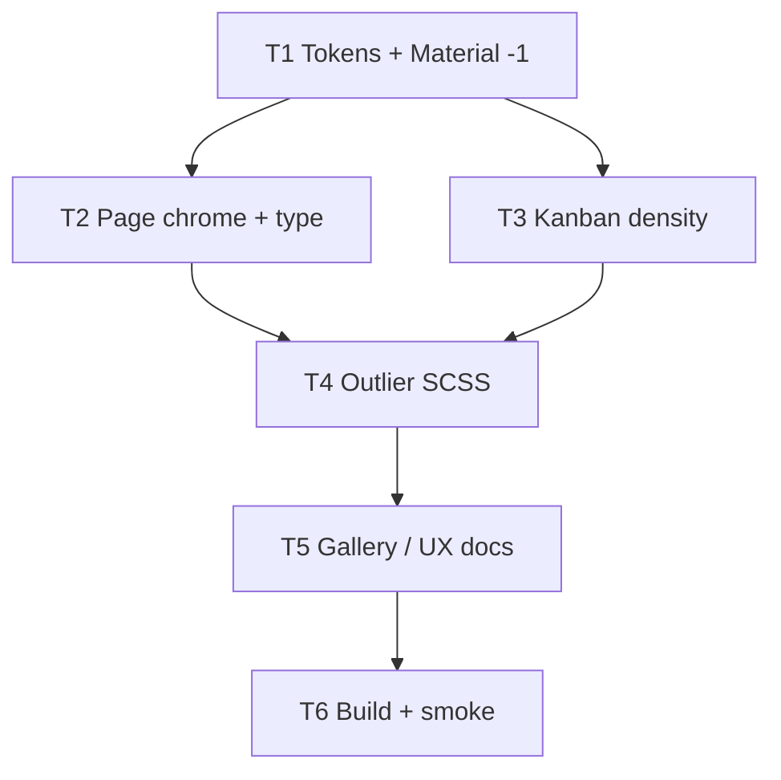

# UI design system — class consistency

**Feature version:** 2  
**Status:** done  
**Requested:** 2026-07-03 · density update 2026-07-11

## Summary

The Issues SPA already defines a flat UI design language ([docs/ui-elements-gallery.md](../docs/ui-elements-gallery.md), [colors.scss](../src/main/webui/src/colors.scss), [styles.scss](../src/main/webui/src/styles.scss)). Version 1 consolidated styling into **compatible global classes**. Version 2 tightens global density so more content fits per viewport without a redesign or “tiny UI” — **comfortable compact** via token-first changes.

## Wireframe

**Guide:** cross-cutting visual contract — each screen follows [ui-elements-gallery.md](../docs/ui-elements-gallery.md) and flat UI tokens. Update when gallery patterns or touched screens change ([development-process.mdc](../.cursor/rules/development-process.mdc)).

| Field | Value |
|-------|-------|
| **Source** | [ui-elements-gallery.md](../docs/ui-elements-gallery.md) — canonical element matrix |
| **Last updated** | 2026-07-11 |

### Pattern reference (all routes)

| Pattern | Class / token | Screens |
|---------|---------------|---------|
| Page shell | `.page`, `.page-header`, `.page-panel` | All authenticated routes |
| Tables | `div.data-table` (not `div.table`) | users, projects, categories, workflows, versions, home, allocation |
| Buttons | `.btn`, `.btn-secondary`, `.btn-cancel` + `matButton` | Global |
| Forms | `.form-field`, `form.edit` | ticket, project, workflow, account |
| Activity | `.activity-feed` | ticket detail, home |
| Filters | `.filter-chip`, `.filter-chip--active` | search, users, kanban |

No single Excalidraw — implementation must match gallery § per screen when consolidating styles.

### Density wireframe (v2 — comfortable compact)

Same layout regions and gallery classes; **rhythm only** changes. Floors: control height ≥ 36px; body text ≥ 0.8125rem; icon targets ≥ 36×36; focus ring 2px.

```
Today (airy)                     Comfortable compact (~15–25% less chrome)
┌──────────────────────────┐     ┌──────────────────────────┐
│ Title 1.5rem             │     │ Title 1.25rem            │
│ subtitle                 │     │ subtitle 0.875rem        │
│                          │     │ ┌──────────────────────┐ │
│  ┌────────────────────┐  │     │ │ more table rows      │ │
│  │ sparse panel 24px  │  │  →  │ │ more kanban cards    │ │
│  │ pad / 40px ctrls   │  │     │ │ panel pad 16px       │ │
│  └────────────────────┘  │     │ │ controls 36px        │ │
└──────────────────────────┘     │ └──────────────────────┘ │
                                 └──────────────────────────┘
```

| Region | Density change |
|--------|----------------|
| App shell | Slightly less header/context/main vertical padding; `$shell-padding-x` 16→12 |
| Page header | Title/subtitle smaller; `margin-bottom` one step down |
| Panels / tables | `$panel-padding` via `$space-lg` 24→16; table cells tighter |
| Toolbar controls | `$control-height` 40→36; Material `density: -1` |
| Kanban | Card pad `$space-sm`; `min-width` 220; description clamp 2; board/column gaps `$space-sm` |
| Auth | **Same** density as app (**FQ2**) — no special airy exception |

## Impact

| Area | Effect |
|------|--------|
| Bounded contexts | None (presentation only) |
| Packages / files | **v1:** `styles.scss`, `colors.scss`, component SCSS, templates, gallery. **v2 density:** `colors.scss` tokens, Material theme `density` in `styles.scss`, page/header/kanban rules, outlier component SCSS (dashboard, notification, rich-text), gallery + UX notes |
| API | None |
| UI | All authenticated routes; auth pages; dialogs; toasts — denser rhythm, same structure |
| Schema / seed | None |
| Tests | `npm run build`; existing Angular specs; manual visual smoke (no screenshot tooling) |
| Docs | `ui-elements-gallery.md` Design tokens + density note; optional `issues-ux.mdc` “comfortable compact” line; domain-spec unchanged (no new vocabulary) |

### Risks

- Large `styles.scss` / token edit may cause subtle regressions across many screens — mitigate with visual smoke checklist and `npm run build`.
- Kanban cards may feel cramped if padding and description clamp both shrink — verify clamp 2 + `$space-sm` pad together.
- Material `density: -1` can surprise outline fields — verify create-ticket and dialogs.
- Mobile (`max-width: 750px`) may need a floor if shell/control shrink feels too tight — check header wrap.
- Deprecating `div.table` (navy) is safe today (no template uses it) but gallery/docs must lead code to avoid reintroduction. *(v1)*
- i18n marker additions require `ng extract-i18n` if translation locales are added later. *(v1; out of scope)*

### Feature questions (FQ*n*)

| # | Question | Status | Answer |
|---|----------|--------|--------|
| Q1 | Standardize on **`div.data-table`** (light chrome) and remove **`div.table`** (navy) from active use? | answered | **Yes** — remove `div.table` from CSS and gallery *(v1)* |
| Q2 | **Filter chip active state:** filled blue (`.filter-chip--active`) or outline (`.filter-chip.active`)? | answered | **`.filter-chip--active`** — only pattern used in templates (search, users) *(v1)* |
| Q3 | **i18n scope** | answered | **Out of scope** — no systematic i18n pass *(v1)* |
| Q4 | **Rollout (v1)** | answered | **Big-bang** — single change set *(v1)* |
| FQ1 | How aggressive is the density reduction? | answered | **A — Mild (~15%)** — token table in Architecture; control height 36px; Material `-1`; not 32px / `-2` |
| FQ2 | Auth pages (login / password reset) — same density or keep airy? | answered | **Same density** as the rest of the app |
| FQ3 | Per-user density preference (setting / toggle)? | answered | **Out of scope** — global density only |
| FQ4 | Rollout for density | answered | **Big-bang** — tokens + Material density first; one visual smoke checklist |

## Architecture

**Guide:** technical design for the current changelog entry (comfortable density). Phase 5 must match unless revised here first ([architecture-design.mdc](../.cursor/rules/architecture-design.mdc)).

| Area | Design |
|------|--------|
| Bounded contexts | Presentation only — no Java package changes |
| Packages / layers | N/A (no Endpoint/Service/Repository) |
| API | None |
| Schema / seed | None |
| Cross-context | None |
| Frontend | Token-first: change `colors.scss` scale + semantic tokens; set Material `density: -1` in `styles.scss` `mat.theme`; tighten page/header/title and kanban card rules that hard-code rem; sweep outlier component SCSS to tokens; update gallery |
| Tests | `npm run build`; smoke checklist; existing specs if selectors break |

### Token map (FQ1 = mild)

| Token | Current | Target |
|-------|---------|--------|
| `$space-xs` | 4px | unchanged |
| `$space-sm` | 8px | unchanged |
| `$space-md` | 16px (`1rem`) | **12px** (`0.75rem`) |
| `$space-lg` | 24px (`1.5rem`) | **16px** (`1rem`) |
| `$space-xl` | 32px (`2rem`) | **24px** (`1.5rem`) |
| `$panel-padding` | `$space-lg` | keep alias (becomes 16px) |
| `$table-cell-padding-x` | `$space-md` | keep alias (becomes 12px) |
| `$table-cell-padding-y` | `$space-sm` (8px) | **6px** (`0.375rem`) |
| `$shell-padding-x` | 16px | **12px** (`0.75rem`) |
| `$control-height` | 40px (`2.5rem`) | **36px** (`2.25rem`) |
| `$control-font-size` | 0.875rem | unchanged |
| `$control-padding-x` | 0.75rem | **0.625rem** |
| Material `density` | `0` | **`-1`** (**AQ1**) |

### Typography / surface overrides (in `styles.scss`)

| Selector | Change |
|----------|--------|
| `.page-title` | `1.5rem` → `1.25rem` |
| `.page-subtitle` | `0.95rem` → `0.875rem` |
| `.page` padding | top/bottom one step down (`md` / `lg`) |
| `.page-header` `margin-bottom` | `lg` → `md` |
| Kanban `.card` padding | → `$space-sm` |
| Kanban `.card` `min-width` | 250px → **220px** |
| Kanban `.card .title` | `1.1rem` → `0.9375rem` |
| Kanban `.card .description` | `-webkit-line-clamp: 3` → **2** |
| `.board` / column gaps | prefer `$space-sm` where `$space-md`/`$space-lg` only add air |

### Floors (must not cross)

- Control height ≥ 36px (this pass)
- Body / table text ≥ 0.8125rem
- Icon hit targets ≥ 36×36
- Focus rings remain 2px
- Flat UI language unchanged (colors, square corners, no elevation growth)

### Architecture questions (AQ*n*)

| # | Question | Status | Answer |
|---|----------|--------|--------|
| AQ1 | Material theme density: keep `0` and only shrink custom tokens, or set `-1`? | answered | **`density: -1`** — aligns outline fields with 36px controls |
| AQ2 | Mutate `$space-*` in place vs introduce parallel `$density-*` tokens? | answered | **In place** (**FQ4** big-bang) — single source of truth; no dual scales |
| AQ3 | Kanban-specific overrides in global `.card` / `.board` only, or component SCSS? | answered | **Global** in `styles.scss` (kanban already global); component SCSS only for true outliers |

---

## Audit findings (2026-07-03)

### A. Foundation — what already works

| Asset | Role |
|-------|------|
| `colors.scss` | Spacing scale (`$space-xs` … `$space-xl`), surfaces, semantic colors, `$shell-padding-x` |
| `styles.scss` | Global classes: `.page`, `.page-panel`, `.btn*`, `.form-field`, `.data-table`, `.filter-*`, kanban, auth |
| `ui-elements-gallery.md` | Canonical element catalog + flat UI principles |
| `issues-ux.mdc` | Mandatory gallery gate before UI changes |
| Angular i18n | `sourceLocale: "pt"`; most screens use `i18n` on labels |

Most screens already use `.page` + `.page-header` + `.page-panel`. Buttons consistently pair `matButton` with `.btn` / `.btn-secondary` / `.btn-cancel`.

### B. Critical inconsistencies

#### B1 — Duplicate `.filter-chip` definitions in `styles.scss`

Two blocks define `.filter-chip` with **different** active semantics:

| Location | Active class | Active appearance |
|----------|--------------|-------------------|
| ~L1378 | `.filter-chip--active` | Filled primary blue |
| ~L1939 | `.filter-chip.active` | Outline blue + muted background |

Templates use **`filter-chip--active`** (search, users). The second block (activity/ticket context) is dead for chips but overrides shared properties (border color, font-weight) depending on cascade order.

**Fix:** one `.filter-chip` block; one modifier (recommend `--active` BEM); remove duplicate.

#### B2 — Two table systems; gallery stale

| Class | Documented | Used in templates |
|-------|------------|-------------------|
| `div.table` | Gallery §6.1 — navy header | **None** |
| `div.data-table` | Gallery §6.2 — light header | users, projects, categories, workflows, versions, ticket history, dashboard widgets |

All list screens migrated to `data-table` but gallery still prescribes `div.table` for admin lists.

**Fix:** promote `data-table` as the single list-table pattern; mark `div.table` deprecated; optional removal from `styles.scss` after doc update.

#### B3 — Undocumented template classes (no or partial CSS)

| Class | Used in | Issue |
|-------|---------|-------|
| `.ticket-actions` | `ticket-view.component.html` | No styles — layout relies on default block flow |
| `.edit-form` | `ticket-view.component.html` | Should be `form.edit` per gallery |
| `.changelog-section` | `version-detail.component.html` | No global styles — unstyled section headings/spacing |
| `.loading` | account-settings, workflow-edit, ticket-view comments | Styled only under `.comments-section` / `.activity-section` — bare `.loading` inconsistent |
| `.form-field--table` | workflow-form | Defined only in component SCSS, not gallery |

#### B4 — Component SCSS bypassing tokens

| File | Issue |
|------|-------|
| `dashboard.component.scss` | Hard-coded `12px`, `14px`, `250px`; duplicates widget/table patterns |
| `toast.component.ts` | Inline `styles: [...]` with hex colors duplicating `$semantic-*` tokens |
| `workflow-form.component.scss` | Reimplements data-table row/header styling as `.workflow-form__list*` |
| `rich-text-editor.component.scss` | Mixed `0.75rem` and `$space-*` |
| `notification.component.scss` | `padding: 0 4px` instead of `$space-xs` |

**Policy target:** component SCSS only for layout unique to that widget; shared table/form/chip patterns live in `styles.scss`.

#### B5 — Padding and spacing drift

| Element | Padding | Notes |
|---------|---------|-------|
| `.page-panel` | `$space-lg` (24px) | Baseline |
| `form.edit.page-panel` | `$space-xl` (32px) | +8px vs other panels on same screen type |
| `.card` (kanban) | `0.75rem` + `$space-md` | 12px + 16px — not on `$space-*` grid |
| `.modal .body` | `$space-md` × `$space-xl` | Different from `.page-panel` |
| Dashboard widget header | `12px` | Not a token |
| Global native `input` | asymmetric `$space-xs $space-xl $space-xs $space-sm` | Heavier right padding than `.filter-input` |

**Fix:** introduce semantic layout tokens e.g. `$panel-padding`, `$table-cell-padding-x`, `$table-cell-padding-y`; reference them everywhere.

#### B6 — i18n gaps (PT source locale)

| Area | Example | Severity |
|------|---------|----------|
| Column header | `ID` without `i18n` | Low (universal) |
| Dashboard toggle | `Salvar layout` / `Editar layout` without `i18n` | Medium |
| Account roles | Raw `admin`, `project-manager`, `user` in labels | Medium |
| Ticket history tab | Backend `entry.action`, `entry.field` in English | Medium — needs display mapping |
| Placeholders | `placeholder="Digite seu comentário..."`, `placeholder="1.0.0"` without `i18n-placeholder` | Medium |
| aria-label | Mix of `i18n-aria-label` and hard-coded Portuguese | Low |
| TS toasts | Mostly PT; pattern not enforced | Low |

Angular i18n is compile-time (`i18n` markers); no runtime `@ngx-translate`. Fixing templates is sufficient for PT-only; TS strings need constants or `$localize` if locales expand.

#### B7 — Legacy classes still in CSS

Gallery marks as legacy: `.centered`, `.form-header`, `.parameters-box`, `.box`. Still present in `styles.scss` (~200 lines). No current template uses `div.table` or `.parameters-box` on search (replaced by `.filter-summary`).

**Fix:** grep for usage; remove unused legacy blocks; keep gallery §4.8 as “removed” list.

#### B8 — Pattern duplication

| Concern | Locations |
|---------|-----------|
| Comment form styling | `.comments-section .comment-form` and `.activity-section .comment-form` — duplicate rules |
| Filter chips container | `.filter-chips` defined twice with different `gap` and `margin-bottom` |
| Form action footer | `.form-actions` vs `form.edit .actions` — same intent, two selectors |

**Fix:** single source for each; alias deprecated selectors for one release if needed.

### C. Class compatibility matrix (target state)

Every UI element should compose from this set:

```
Shell          .main-header, .context-bar, .shell-inner, main.container, .main-footer
Page           .page, .page-header, .page-title, .page-subtitle, .page-header__actions
Panel          .page-panel, .page-panel--flush
Auth           .page-auth, .auth-card, .auth-card__header, .auth-card__body
Navigation     .breadcrumb, .tabs, .tab-button, .tab-button--active
Actions        .btn, .btn-secondary, .btn-cancel, .btn-icon-header, .btn-icon-only, .form-actions
Forms          mat-form-field.form-field, .form-field--compact, .form-field--textarea, .form-field--table, form.edit, .dialog-form
Filters        .filter-bar, .filter-bar__label, .filter-bar__fields, .filter-chips, .filter-chip, .filter-chip--active, .filter-summary
Data           .data-table, .data-table--empty, .data-table--cols-*, .detail-list, .empty-state
Feedback       .error, .success-message, .loading, .widget-loading, .toast-*
Domain         .board, .column, .card, .project-grid, .project-card, .activity-feed, .activity-item, .status-badge, .category-badge
```

**Compatibility rules:**

1. **Panel padding** — always `$panel-padding` unless `--flush`.
2. **Tables** — admin lists use `.page-panel--flush` > `.data-table`; action column uses `.cell-actions` / `.header-cell--actions`.
3. **Buttons** — always `matButton` + gallery class; never bare Material button.
4. **Active modifiers** — BEM `--modifier` only (not `.active` on chips; `.tab-button--active` alias for tabs).
5. **Component SCSS** — allowed for CDK drag grids and rich-text toolbar only; must `@use` colors.

### D. Screen compliance snapshot

| Screen | Page scaffold | Table | Forms | i18n | Local SCSS | Notes |
|--------|---------------|-------|-------|------|------------|-------|
| Home | ✅ | — | — | ✅ | — | |
| Kanban | ✅ | — | — | ✅ | — | |
| Search | ✅ | — | ✅ filters | ✅ | — | Correct `--active` chips |
| Users | ✅ | ✅ data-table | ✅ filter-bar | ✅ | — | |
| Projects | ✅ | ✅ data-table | — | ✅ | — | |
| Categories | ✅ | ✅ + grid modifier | dialog ✅ | ✅ | — | |
| Workflows list | ✅ | ✅ data-table | — | ⚠️ ID | — | |
| Workflow form | ✅ | custom list | ✅ | ✅ | ⚠️ duplicate table | Promote list pattern |
| Versions | ✅ | ✅ data-table | ✅ | ✅ | — | changelog-section unstyled |
| Ticket view | ✅ | ✅ | ⚠️ edit-form | ⚠️ history EN | — | ticket-actions unstyled |
| Ticket import | ✅ | ✅ preview table | ✅ | ✅ | — | |
| Dashboard | ✅ | ✅ widgets | — | ⚠️ toggle | ⚠️ hard-coded px | |
| Account | ✅ | — | ✅ | ⚠️ roles | — | bare `.loading` |
| Auth | ✅ | — | ✅ | ✅ | minimal | |
| Toast | — | — | — | — | ⚠️ inline styles | Move to global |

---

## Changelog

### Comfortable UI density — 2026-07-11

**Version:** 2  
**Status:** done

**Description:** Reduce global spacing, control height, and selected typography so more elements fit on screen while staying readable — **comfortable compact** (~15% denser). Token-first; Material `density: -1`; kanban and page chrome tightened; auth uses the same density. No API, schema, or flat-UI language redesign.

**Impact on other features:**

| Feature / area | Impact |
|----------------|--------|
| All UI routes | Denser layout — more rows/cards visible; same classes and behaviour |
| Kanban board | Shorter/narrower cards; more tickets visible per column |
| Project dashboard | Widgets inherit tighter tokens; outlier SCSS aligned |
| Auth / account | Same density as app (**FQ2**) |
| — | No API or schema impact |

#### Feature checklist

| ID | Criterion | Source | Done |
|----|-----------|--------|------|
| FC1 | Spacing/control tokens match Architecture token map | FQ1, Architecture | ☑ |
| FC2 | Material theme `density: -1` | AQ1 | ☑ |
| FC3 | Page title/subtitle and page chrome match Wireframe density | Wireframe, FQ1 | ☑ |
| FC4 | Kanban cards: pad `$space-sm`, min-width 220, title 0.9375rem, clamp 2 | Wireframe | ☑ |
| FC5 | Auth screens use same tokens (not exempt) | FQ2 | ☑ |
| FC6 | Floors held: control ≥36px; body ≥0.8125rem; focus 2px | Architecture | ☑ |
| FC7 | No per-user density setting | FQ3 | ☑ |
| FC8 | `ui-elements-gallery.md` Design tokens + density note updated | Impact / Docs | ☑ |
| FC9 | Visual smoke: home, kanban, search, ticket, users, forms, login, mobile ≤750px | TC3 | ☑ |
| FC10 | `npm run build` green | TC1 | ☑ |

#### Tasks

| ID | Task | Done |
|----|------|------|
| T1 | **Tokens + Material** — update `$space-md/lg/xl`, table-y, shell, control height/padding in `colors.scss`; set `density: -1` in `styles.scss` | ☑ |
| T2 | **Page chrome + type** — `.page` / `.page-header` / `.page-title` / `.page-subtitle` per Architecture | ☑ |
| T3 | **Kanban density** — `.board` / `.column` / `.card` gaps, padding, min-width, title, line-clamp | ☑ |
| T4 | **Outlier SCSS** — dashboard, notification, rich-text (and similar) hard-coded pad → tokens where needed | ☑ |
| T5 | **Docs** — gallery Design tokens + density note; optional one-line comfortable-compact in `issues-ux.mdc` | ☑ |
| T6 | **Verify** — `npm run build` + manual smoke checklist (FC9) | ☑ |

#### Test coverage

| ID | Test | Covers | Done |
|----|------|--------|------|
| TC1 | `npm run build` (production) | T1–T5 | ☑ |
| TC2 | Existing `*.component.spec.ts` for any touched components | T2–T4 if selectors change | ☑ |
| TC3 | Manual smoke: login, home, kanban, search, ticket, users, dashboard, create-ticket, mobile ≤750px | Full visual; FC6/FC9 | ☑ |

**Development approval:** approved 2026-07-11 — tasks: T1, T2, T3, T4, T5, T6

**Implementation notes:** 2026-07-11 comfortable-compact density. Tokens: `$space-md/lg/xl` → 12/16/24px; `$shell-padding-x` 12px; `$control-height` 36px; `$table-cell-padding-y` 6px; Material `density: -1`. Page title 1.25rem / subtitle 0.875rem. Kanban: card pad `$space-sm`, min-width 220, clamp 2. Dashboard/notification/rich-text tightened to tokens. Gallery + `issues-ux.mdc` updated. `npm run build` green. Follow-up: Kanban phase/`Agrupar por` selects — widened `.board-phase-filter` (max 22rem), stopped stacking fixed heights on infix+trigger (vertical clip), `panelClass="board-phase-filter-panel"` for wrapping options.

---

### Unify application CSS classes and i18n — 2026-07-03

**Version:** 1  
**Status:** done

**Description:** Consolidate duplicate global styles, align all templates to the gallery class matrix, migrate component-local CSS to tokens, and close i18n gaps.

**Impact on other features:**

| Feature / area | Impact |
|----------------|--------|
| All UI routes | Visual consistency only — no behaviour change |
| Phase / versions UI | `changelog-section` gains proper classes |
| Workflow configuration | Form list may share global `.inline-table` pattern |
| Ticket management | `ticket-actions` toolbar styled; history labels PT |
| Project dashboard | Widget SCSS thinned; tokens for padding |
| — | No API or schema impact |

#### Feature checklist

| ID | Criterion | Source | Done |
|----|-----------|--------|------|
| FC1 | All touched screens use gallery classes per **Wireframe** | Wireframe | ☑ |
| FC2 | `div.table` removed; `div.data-table` standard | Q1, Wireframe | ☑ |
| FC3 | Single `.filter-chip--active` pattern | Q2 | ☑ |
| FC4 | `ui-elements-gallery.md` updated | T8 | ☑ |
| FC5 | `npm run build` green | TC1 | ☑ |

#### Tasks (phase 2)

| ID | Task | Done |
|----|------|------|
| T1 | **Token pass** — add `$panel-padding`, `$table-cell-padding-x/y` to `colors.scss`; document in gallery § Design tokens | ☑ |
| T2 | **Deduplicate `styles.scss`** — merge duplicate `.filter-chip`, `.filter-chips`; unify comment-form rules; single `.loading` block | ☑ |
| T3 | **Deprecate `div.table`** — update gallery + remove unused CSS (verify grep clean) | ☑ |
| T4 | **Promote shared patterns** — extract `.inline-table` from workflow-form; add `.ticket-actions`, `.changelog-section`, global `.form-field--table` | ☑ |
| T5 | **Template alignment** — replace `.edit-form` → `form.edit`; tab active → `.tab-button--active`; workflow form → `.inline-table` | ☑ |
| T6 | **Component SCSS cleanup** — move toast styles to `styles.scss`; refactor dashboard/notification/rich-text to tokens only | ☑ |
| T7 | ~~**i18n pass**~~ | cancelled — Q3 |
| T8 | **Gallery + audit docs** — update `ui-elements-gallery.md`; refresh `ui-nielsen-audit.md` § consistency | ☑ |

#### Test coverage (phase 2)

| ID | Test | Covers | Done |
|----|------|--------|------|
| TC1 | `npm run build` (production) | T1–T6 — compile + budget | ☑ |
| TC2 | Existing `*.component.spec.ts` for touched components | T5–T7 — no broken selectors | ☑ |
| TC3 | Manual checklist: login, home, users, projects, ticket, kanban, dashboard, workflows, versions | Full visual smoke | ☑ |

**Development approval:** approved 2026-07-03 — tasks: T1, T2, T3, T4, T5, T6, T8 (T7 cancelled per Q3)

**Implementation notes:** Big-bang pass 2026-07-03. Q1: removed `div.table`. Q2: `.filter-chip--active` (filled blue — only pattern in templates). Q3: i18n out of scope. Added layout tokens; deduplicated filter-chip and comment-form CSS; global `.inline-table`, `.ticket-actions`, `.changelog-section`, `.loading`, toast classes; workflow form and ticket view templates aligned. `npm run build` green.

---

## Recommended implementation order (v2 density)



1. **Tokens + Material** (T1) — cascade wins everywhere that already uses `$space-*` / `$control-*`.
2. **Chrome + kanban** (T2–T3) — remaining hard-coded rem/px that tokens do not reach.
3. **Outliers + docs** (T4–T5) — dashboard/notification/rich-text; lock contract in gallery.
4. **Verify** (T6) — build + smoke; hold floors.

---

## Out of scope (unless user expands)

- Dark mode / theme switching
- CSS modules or Tailwind migration
- Runtime i18n library (`ngx-translate`)
- Visual regression screenshot tooling (Percy/Chromatic)
- Full redesign of flat UI language (colors, geometry, elevation)
- Per-user density preference (**FQ3**)
- Aggressive density (32px controls / Material `-2`) — revisit only if mild pass is insufficient
