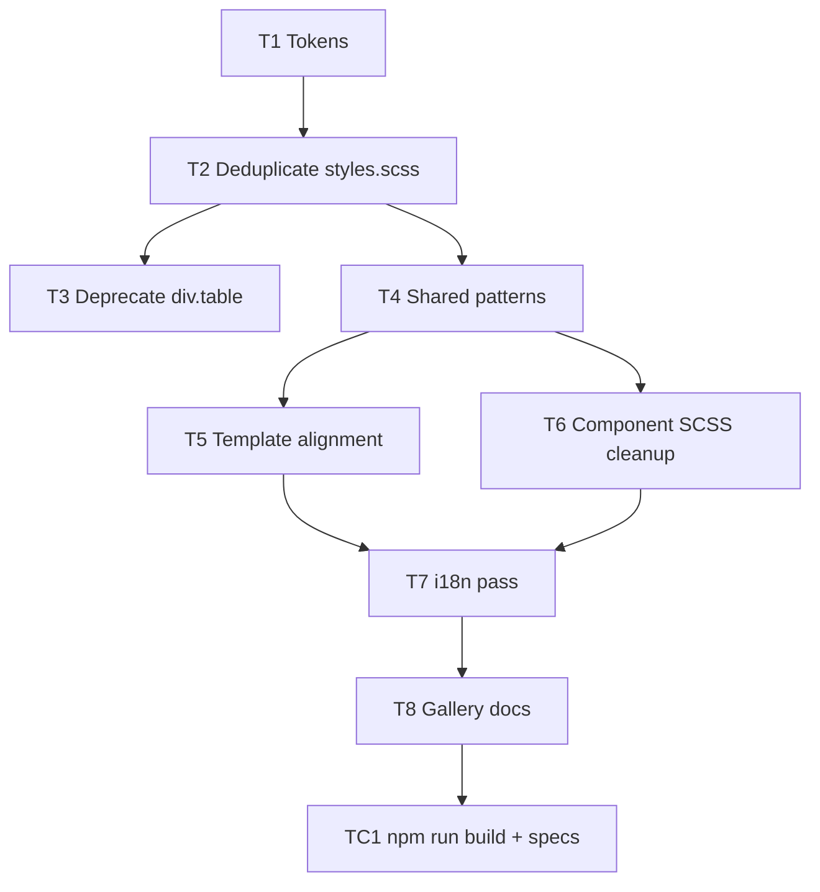

# UI design system — class consistency

**Feature version:** 1  
**Status:** done  
**Requested:** 2026-07-03

## Summary

The Issues SPA already defines a flat UI design language ([docs/ui-elements-gallery.md](../docs/ui-elements-gallery.md), [colors.scss](../src/main/webui/src/colors.scss), [styles.scss](../src/main/webui/src/styles.scss)). In practice, screens diverge: duplicate CSS rules, undocumented template classes, component-local SCSS with hard-coded spacing, and incomplete i18n. This feature consolidates styling into **compatible global classes** so every element maps to the gallery and tokens — no ad-hoc padding or one-off patterns.

## Impact

| Area | Effect |
|------|--------|
| Bounded contexts | None (presentation only) |
| Packages / files | `src/main/webui/src/styles.scss`, `colors.scss`, ~6 component SCSS files, ~22 HTML templates, `toast.component.ts`, `docs/ui-elements-gallery.md`, `docs/ui-nielsen-audit.md` |
| API | None |
| UI | All authenticated routes; auth pages; dialogs; toasts |
| Schema / seed | None |
| Tests | Update Angular specs if class selectors change; visual regression via existing component specs |
| Docs | `ui-elements-gallery.md`, `ui-nielsen-audit.md`, `conventions-checklist.md`; README only if user-visible capability wording changes |

### Risks

- Large `styles.scss` edit may cause subtle regressions across many screens — mitigate with screen-by-screen checklist and `npm run build` + targeted specs per batch.
- Deprecating `div.table` (navy) is safe today (no template uses it) but gallery/docs must lead code to avoid reintroduction.
- i18n marker additions require `ng extract-i18n` if translation locales are added later.

### Open questions

| # | Question | Status | Answer |
|---|----------|--------|--------|
| Q1 | Standardize on **`div.data-table`** (light chrome) and remove **`div.table`** (navy) from active use? | answered | **Yes** — remove `div.table` from CSS and gallery |
| Q2 | **Filter chip active state:** filled blue (`.filter-chip--active`) or outline (`.filter-chip.active`)? | answered | **`.filter-chip--active`** — only pattern used in templates (search, users) |
| Q3 | **i18n scope** | answered | **Out of scope** — no systematic i18n pass; fix obvious untranslated UI copy only when touching a screen |
| Q4 | **Rollout** | answered | **Big-bang** — single change set |

---

## Audit findings (2026-07-03)

### A. Foundation — what already works

| Asset | Role |
|-------|------|
| `colors.scss` | Spacing scale (`$space-xs` … `$space-xl`), surfaces, semantic colors, `$shell-padding-x` |
| `styles.scss` | Global classes: `.page`, `.page-panel`, `.btn*`, `.form-field`, `.data-table`, `.filter-*`, kanban, auth |
| `ui-elements-gallery.md` | Canonical element catalog + flat UI principles |
| `issues-ux.mdc` | Mandatory gallery gate before UI changes |
| Angular i18n | `sourceLocale: "pt"`; most screens use `i18n` on labels |

Most screens already use `.page` + `.page-header` + `.page-panel`. Buttons consistently pair `matButton` with `.btn` / `.btn-secondary` / `.btn-cancel`.

### B. Critical inconsistencies

#### B1 — Duplicate `.filter-chip` definitions in `styles.scss`

Two blocks define `.filter-chip` with **different** active semantics:

| Location | Active class | Active appearance |
|----------|--------------|-------------------|
| ~L1378 | `.filter-chip--active` | Filled primary blue |
| ~L1939 | `.filter-chip.active` | Outline blue + muted background |

Templates use **`filter-chip--active`** (search, users). The second block (activity/ticket context) is dead for chips but overrides shared properties (border color, font-weight) depending on cascade order.

**Fix:** one `.filter-chip` block; one modifier (recommend `--active` BEM); remove duplicate.

#### B2 — Two table systems; gallery stale

| Class | Documented | Used in templates |
|-------|------------|-------------------|
| `div.table` | Gallery §6.1 — navy header | **None** |
| `div.data-table` | Gallery §6.2 — light header | users, projects, categories, workflows, versions, ticket history, dashboard widgets |

All list screens migrated to `data-table` but gallery still prescribes `div.table` for admin lists.

**Fix:** promote `data-table` as the single list-table pattern; mark `div.table` deprecated; optional removal from `styles.scss` after doc update.

#### B3 — Undocumented template classes (no or partial CSS)

| Class | Used in | Issue |
|-------|---------|-------|
| `.ticket-actions` | `ticket-view.component.html` | No styles — layout relies on default block flow |
| `.edit-form` | `ticket-view.component.html` | Should be `form.edit` per gallery |
| `.changelog-section` | `version-detail.component.html` | No global styles — unstyled section headings/spacing |
| `.loading` | account-settings, workflow-edit, ticket-view comments | Styled only under `.comments-section` / `.activity-section` — bare `.loading` inconsistent |
| `.form-field--table` | workflow-form | Defined only in component SCSS, not gallery |

#### B4 — Component SCSS bypassing tokens

| File | Issue |
|------|-------|
| `dashboard.component.scss` | Hard-coded `12px`, `14px`, `250px`; duplicates widget/table patterns |
| `toast.component.ts` | Inline `styles: [...]` with hex colors duplicating `$semantic-*` tokens |
| `workflow-form.component.scss` | Reimplements data-table row/header styling as `.workflow-form__list*` |
| `rich-text-editor.component.scss` | Mixed `0.75rem` and `$space-*` |
| `notification.component.scss` | `padding: 0 4px` instead of `$space-xs` |

**Policy target:** component SCSS only for layout unique to that widget; shared table/form/chip patterns live in `styles.scss`.

#### B5 — Padding and spacing drift

| Element | Padding | Notes |
|---------|---------|-------|
| `.page-panel` | `$space-lg` (24px) | Baseline |
| `form.edit.page-panel` | `$space-xl` (32px) | +8px vs other panels on same screen type |
| `.card` (kanban) | `0.75rem` + `$space-md` | 12px + 16px — not on `$space-*` grid |
| `.modal .body` | `$space-md` × `$space-xl` | Different from `.page-panel` |
| Dashboard widget header | `12px` | Not a token |
| Global native `input` | asymmetric `$space-xs $space-xl $space-xs $space-sm` | Heavier right padding than `.filter-input` |

**Fix:** introduce semantic layout tokens e.g. `$panel-padding`, `$table-cell-padding-x`, `$table-cell-padding-y`; reference them everywhere.

#### B6 — i18n gaps (PT source locale)

| Area | Example | Severity |
|------|---------|----------|
| Column header | `ID` without `i18n` | Low (universal) |
| Dashboard toggle | `Salvar layout` / `Editar layout` without `i18n` | Medium |
| Account roles | Raw `admin`, `project-manager`, `user` in labels | Medium |
| Ticket history tab | Backend `entry.action`, `entry.field` in English | Medium — needs display mapping |
| Placeholders | `placeholder="Digite seu comentário..."`, `placeholder="1.0.0"` without `i18n-placeholder` | Medium |
| aria-label | Mix of `i18n-aria-label` and hard-coded Portuguese | Low |
| TS toasts | Mostly PT; pattern not enforced | Low |

Angular i18n is compile-time (`i18n` markers); no runtime `@ngx-translate`. Fixing templates is sufficient for PT-only; TS strings need constants or `$localize` if locales expand.

#### B7 — Legacy classes still in CSS

Gallery marks as legacy: `.centered`, `.form-header`, `.parameters-box`, `.box`. Still present in `styles.scss` (~200 lines). No current template uses `div.table` or `.parameters-box` on search (replaced by `.filter-summary`).

**Fix:** grep for usage; remove unused legacy blocks; keep gallery §4.8 as “removed” list.

#### B8 — Pattern duplication

| Concern | Locations |
|---------|-----------|
| Comment form styling | `.comments-section .comment-form` and `.activity-section .comment-form` — duplicate rules |
| Filter chips container | `.filter-chips` defined twice with different `gap` and `margin-bottom` |
| Form action footer | `.form-actions` vs `form.edit .actions` — same intent, two selectors |

**Fix:** single source for each; alias deprecated selectors for one release if needed.

### C. Class compatibility matrix (target state)

Every UI element should compose from this set:

```
Shell          .main-header, .context-bar, .shell-inner, main.container, .main-footer
Page           .page, .page--wide, .page-header, .page-title, .page-subtitle, .page-header__actions
Panel          .page-panel, .page-panel--flush
Auth           .page-auth, .auth-card, .auth-card__header, .auth-card__body
Navigation     .breadcrumb, .tabs, .tab-button, .tab-button--active
Actions        .btn, .btn-secondary, .btn-cancel, .btn-icon-header, .btn-icon-only, .form-actions
Forms          mat-form-field.form-field, .form-field--compact, .form-field--textarea, .form-field--table, form.edit, .dialog-form
Filters        .filter-bar, .filter-bar__label, .filter-bar__fields, .filter-chips, .filter-chip, .filter-chip--active, .filter-summary
Data           .data-table, .data-table--empty, .data-table--cols-*, .detail-list, .empty-state
Feedback       .error, .success-message, .loading, .widget-loading, .toast-*
Domain         .board, .column, .card, .project-grid, .project-card, .activity-feed, .activity-item, .status-badge, .category-badge
```

**Compatibility rules:**

1. **Panel padding** — always `$panel-padding` unless `--flush`.
2. **Tables** — admin lists use `.page-panel--flush` > `.data-table`; action column uses `.cell-actions` / `.header-cell--actions`.
3. **Buttons** — always `matButton` + gallery class; never bare Material button.
4. **Active modifiers** — BEM `--modifier` only (not `.active` on chips; `.tab-button--active` alias for tabs).
5. **Component SCSS** — allowed for CDK drag grids and rich-text toolbar only; must `@use` colors.

### D. Screen compliance snapshot

| Screen | Page scaffold | Table | Forms | i18n | Local SCSS | Notes |
|--------|---------------|-------|-------|------|------------|-------|
| Home | ✅ | — | — | ✅ | — | |
| Kanban | ✅ | — | — | ✅ | — | |
| Search | ✅ | — | ✅ filters | ✅ | — | Correct `--active` chips |
| Users | ✅ | ✅ data-table | ✅ filter-bar | ✅ | — | |
| Projects | ✅ | ✅ data-table | — | ✅ | — | |
| Categories | ✅ | ✅ + grid modifier | dialog ✅ | ✅ | — | |
| Workflows list | ✅ | ✅ data-table | — | ⚠️ ID | — | |
| Workflow form | ✅ | custom list | ✅ | ✅ | ⚠️ duplicate table | Promote list pattern |
| Versions | ✅ | ✅ data-table | ✅ | ✅ | — | changelog-section unstyled |
| Ticket view | ✅ | ✅ | ⚠️ edit-form | ⚠️ history EN | — | ticket-actions unstyled |
| Ticket import | ✅ | ✅ preview table | ✅ | ✅ | — | |
| Dashboard | ✅ | ✅ widgets | — | ⚠️ toggle | ⚠️ hard-coded px | |
| Account | ✅ | — | ✅ | ⚠️ roles | — | bare `.loading` |
| Auth | ✅ | — | ✅ | ✅ | minimal | |
| Toast | — | — | — | — | ⚠️ inline styles | Move to global |

---

## Changelog

### Unify application CSS classes and i18n — 2026-07-03

**Version:** 1  
**Status:** done

**Description:** Consolidate duplicate global styles, align all templates to the gallery class matrix, migrate component-local CSS to tokens, and close i18n gaps.

**Impact on other features:**

| Feature / area | Impact |
|----------------|--------|
| All UI routes | Visual consistency only — no behaviour change |
| Phase / versions UI | `changelog-section` gains proper classes |
| Workflow configuration | Form list may share global `.inline-table` pattern |
| Ticket management | `ticket-actions` toolbar styled; history labels PT |
| Project dashboard | Widget SCSS thinned; tokens for padding |
| — | No API or schema impact |

#### Tasks (phase 2)

| ID | Task | Done |
|----|------|------|
| T1 | **Token pass** — add `$panel-padding`, `$table-cell-padding-x/y` to `colors.scss`; document in gallery § Design tokens | ☑ |
| T2 | **Deduplicate `styles.scss`** — merge duplicate `.filter-chip`, `.filter-chips`; unify comment-form rules; single `.loading` block | ☑ |
| T3 | **Deprecate `div.table`** — update gallery + remove unused CSS (verify grep clean) | ☑ |
| T4 | **Promote shared patterns** — extract `.inline-table` from workflow-form; add `.ticket-actions`, `.changelog-section`, global `.form-field--table` | ☑ |
| T5 | **Template alignment** — replace `.edit-form` → `form.edit`; tab active → `.tab-button--active`; workflow form → `.inline-table` | ☑ |
| T6 | **Component SCSS cleanup** — move toast styles to `styles.scss`; refactor dashboard/notification/rich-text to tokens only | ☑ |
| T7 | ~~**i18n pass**~~ | cancelled — Q3 |
| T8 | **Gallery + audit docs** — update `ui-elements-gallery.md`; refresh `ui-nielsen-audit.md` § consistency | ☑ |

#### Test coverage (phase 2)

| ID | Test | Covers | Done |
|----|------|--------|------|
| TC1 | `npm run build` (production) | T1–T6 — compile + budget | ☑ |
| TC2 | Existing `*.component.spec.ts` for touched components | T5–T7 — no broken selectors | ☑ |
| TC3 | Manual checklist: login, home, users, projects, ticket, kanban, dashboard, workflows, versions | Full visual smoke | ☐ |

**Development approval:** approved 2026-07-03 — tasks: T1, T2, T3, T4, T5, T6, T8 (T7 cancelled per Q3)

**Implementation notes:** Big-bang pass 2026-07-03. Q1: removed `div.table`. Q2: `.filter-chip--active` (filled blue — only pattern in templates). Q3: i18n out of scope. Added layout tokens; deduplicated filter-chip and comment-form CSS; global `.inline-table`, `.ticket-actions`, `.changelog-section`, `.loading`, toast classes; workflow form and ticket view templates aligned. `npm run build` green.

---

## Recommended implementation order



1. **Tokens + dedupe** (T1–T2) — lowest risk, fixes cascade bugs (filter chips).
2. **Pattern extraction** (T3–T4) — workflow list and ticket toolbar become gallery citizens.
3. **Template sweep** (T5) — one screen group per commit optional (Q4).
4. **i18n** (T7) — can parallel templates; TS strings after Q3 answer.
5. **Docs** (T8) — lock the contract for future features.

---

## Out of scope (unless user expands)

- Dark mode / theme switching
- CSS modules or Tailwind migration
- Runtime i18n library (`ngx-translate`)
- Visual regression screenshot tooling (Percy/Chromatic)
- Redesign of flat UI language itself
